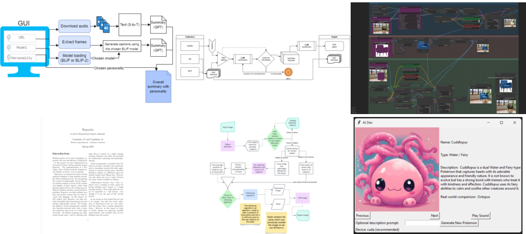

# Generative AI first edition, spring 2024

You can find the description of the course and the topics covered in the file `FYS3810-SpecialcurriculumGenerativeAI.pdf`

You can see below the student projects made during the course (several are quite fun!):

* Automatic summary of videos https://github.com/sofiejoha/gen-ai
* Crawlinator, information retrieval about companies from the web https://github.com/SondreUM/gen-ai
* Reportix, assistant for writing reports https://github.com/victorzimmer/Reportix
* Improving photos using Generative AI https://github.com/MicheleUIT/gen-ai-photography
* Pokemon card generator https://github.com/axdeux/Generative-AI-project
* Inserting furniture in images with generative AI https://github.com/dinasolskinnsbakk/GenerativeAI

